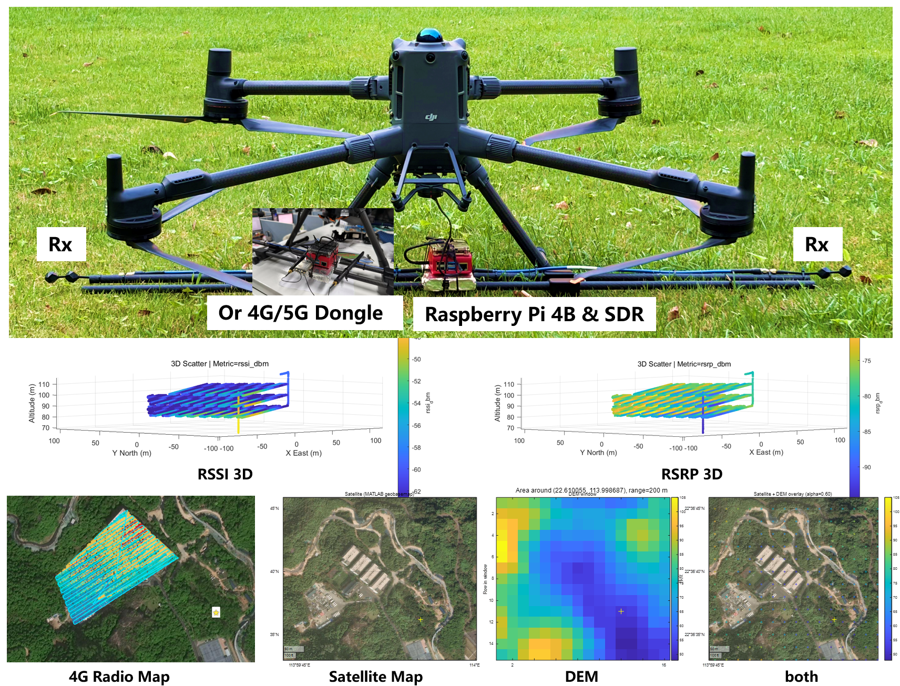

# DJI Payload SDK (PSDK)

## About This Fork

This repository is based on DJI Payload SDK 3.13.1, with changes for running and compiling the Linux sample directly on
Raspberry Pi 4B. The default Linux build entry has been switched to the Raspberry Pi platform samples, and the Raspberry
Pi configuration is prepared for a USB network/RNDIS-style connection to the aircraft instead of the original Manifold
target setup.

This fork is used for an M400 payload experiment that mounts a Raspberry Pi 4B, SDR hardware and a 4G/5G dongle on the
aircraft to collect cellular base-station and radio-signal measurements during flight. The onboard Raspberry Pi reads
flight-controller telemetry through DJI PSDK and combines it with radio measurements so the collected data can be used to
build RSSI/RSRP 3D radio maps, satellite-map overlays and DEM-based visualization after the flight.

The flight-controller subscription sample in `samples/sample_c/module_sample/fc_subscription` has also been extended for
data logging. In addition to the original quaternion, velocity and GPS examples, it subscribes to and records extra
flight data including fused position, RTK position, visual odometry position and flight status. The sample writes
timestamped debug data files on the Raspberry Pi, making it easier to collect flight-controller telemetry during tests.

## What is the DJI Payload SDK?

The DJI Payload SDK(PSDK), is a development kit provided by DJI to support developers to develop payload that can be
mounted on DJI drones. Combined with the X-Port, SkyPort or extension port adapter, developers can obtain the
information or other resource from the drone. According to the software logic and algorithm framework designed by the
developer, users could develop payload that can be mounted on DJI Drone, to perform actions they need, such as Automated
Flight Controller, Payload Controller, Video Image Analysis Platform, Mapping Camera, Megaphone And Searchlight, etc.

## Documentation

For full documentation, please visit
the [DJI Developer Documentation](https://developer.dji.com/doc/payload-sdk-tutorial/en/). Documentation regarding the
code can be found in the [PSDK API Reference](https://developer.dji.com/doc/payload-sdk-api-reference/en/)
section of the developer's website. Please visit
the [Latest Version Information](https://developer.dji.com/doc/payload-sdk-tutorial/en/)
to get the latest version information.

## Latest Release

The latest release version of PSDK is 3.13.1. This version of Payload SDK mainly add some new features support and fixed some
bugs. Please refer to the release notes for detailed changes list.

### Released Feature List

* Supports Mavic 3TA  model

### Bug Fixes and Performance Improvements
* Fixed an issue where the `DjiCore_Init` API failed on the Matrice 300.
* Fixed an issue where quaternion data subscription failed for the Matrice 350 RTK.
* Fixed occasional failures in the `DjiCore_Deinit` API.
* Fixed occasional crashes caused by custom HMS modules.
* Changed the default to not support RC-less flight. and exposed the `DjiFlightController_SetRCLostActionEnableStatus` API to disable or enable actions when the RC is lost.
Note If you need to use RC-less flight, you must call this interface to disable RC-lost actions after `DjiFlightController_Init`. See the interface header file documentation for details.  
## License

Payload SDK codebase is MIT-licensed. Please refer to the LICENSE file for detailed information.

## Support

You can get official support from DJI and the community with the following methods:

- Post questions on Developer Forum
    * [DJI SDK Developer Forum(Cn)](https://djisdksupport.zendesk.com/hc/zh-cn/community/topics)
    * [DJI SDK Developer Forum(En)](https://djisdksupport.zendesk.com/hc/en-us/community/topics)
- Submit a request describing your problem on Developer Support
    * [DJI SDK Developer Support(Cn)](https://djisdksupport.zendesk.com/hc/zh-cn/requests/new)
    * [DJI SDK Developer Support(En)](https://djisdksupport.zendesk.com/hc/en-us/requests/new)

You can also communicate with other developers by the following methods:

- Post questions on [**Stackoverflow**](http://stackoverflow.com) using [**
  dji-sdk**](http://stackoverflow.com/questions/tagged/dji-sdk) tag

## About Pull Request
As always, the DJI Dev Team is committed to improving your developer experience, and we also welcome your contribution,
but the code review of any pull request maybe not timely, when you have any questionplease send an email to dev@dji.com.
